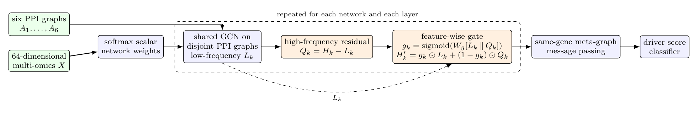

[](#)
[](LICENSE)
[](#)

# HeteroDriverGNN

**Heterophily-Aware Multilayer Graph Neural Network for Cancer Driver Gene Prioritization**

<strong>Manuscript</strong>: submitted to *IEEE/ACM Transactions on Computational Biology and Bioinformatics*

Identifying cancer driver genes from the vast background of passenger mutations is a central challenge in computational oncology. Existing computational methods, including deep graph neural networks, usually learn on a single biological network, which cannot capture the full complexity of tumorigenesis, and models trained on different networks often yield conflicting predictions. Here, we extend the <strong>Explainable Multilayer Graph Neural Network (EMGNN)</strong> framework with a <strong>feature-wise gate</strong> that fuses a graph-smoothed branch with a residual-difference branch at every layer, explicitly accounting for heterophily in protein--protein interaction (PPI) networks. The model integrates six PPI networks and 64-dimensional pan-cancer multi-omics features (mutation, expression, methylation, copy number across 16 TCGA cancer types) for cancer driver gene prioritization.

Across three matched-seed legacy runs, the gated model reached a mean test AUPR of <strong>0.8240 ± 0.0044</strong> (paired difference +0.0243 vs. the matched baseline; paired *p* = 0.0295), the largest observed improvement among five evaluated extensions. A post-hoc label-mixing analysis shows that the six PPI networks exhibit mixed rather than uniformly homophilic geometry, and Integrated Gradients plus Hallmark enrichment provide a prioritization workflow for the 15,157 checkpoint-unindexed candidate genes. The work is described in full in the accompanying manuscript; this repository contains the complete implementation and analysis scripts.



## Main Results

| Configuration | Test AUPR (mean ± SD) | Test AUROC | Paired Δ AUPR vs. baseline |
|---|---|---|---|
| Baseline (three matched seeds) | 0.7997 ± 0.0044 | 0.9155 ± 0.0014 | — |
| **Feature-wise gate (heterophily-aware)** | **0.8240 ± 0.0044** | **0.9194 ± 0.0010** | **+0.0243** |
| Cross-network attention | 0.8142 ± 0.0053 | 0.9176 ± 0.0028 | +0.0144 |
| DropEdge (rate 0.1) | 0.8064 ± 0.0061 | 0.9158 ± 0.0015 | +0.0067 |
| GraphMAE pretraining (200 epochs) | 0.8002 ± 0.0075 | 0.9155 ± 0.0030 | +0.0004 |
| Focal loss (γ = 2, α = 0.75) | 0.7608 ± 0.0045 | 0.8905 ± 0.0029 | −0.0390 |

*Values are means ± sample standard deviations across three seed-aligned legacy runs (seeds 72, 1, 2). Mean differences are descriptive contrasts against the three-run baseline mean; the archived runs predate deterministic split manifests, so no paired inferential claim is made.*

Key results reported in the manuscript:

1. **The feature-wise gate is the most effective single extension** (+0.0243 AUPR, observed in all three matched seeds). The gate adds 24,768 parameters (98.7% increase) and combines graph-smoothed and residual-difference branches at all three layers.
2. **Multi-network integration is valuable.** Six-network configurations markedly improve over the CPDB-only baseline, but historical protocols differ across rows, so the gains are reported as a project trajectory rather than a controlled ablation.
3. **BatchNorm hurts full-batch graph learning** (−0.042 AUPR in one CPDB configuration). In full-batch training, running statistics provide no regularisation benefit.
4. **The PPI benchmark has mixed label geometry.** Prevalence-adjusted homophily is positive for CPDB, IRefIndex-2015, and STRING but negative for IRefIndex, Multinet, and PCNet — motivating adaptive retention of both smoothed and residual signals.
5. **Post-hoc interpretation.** Integrated Gradients across three checkpoint-specific 20-gene cohorts highlights GE:BRCA, GE:LIHC, and CNA:LUAD; Hallmark over-representation finds 23 of 50 gene sets enriched (q < 0.05) among the top-200 checkpoint-unindexed candidates.

## Requirements

- Python 3.10
- PyTorch 2.2 + PyTorch Geometric
- captum (Integrated Gradients)
- gseapy (ORA / preranked GSEA)
- optuna (hyperparameter search)
- h5py, pandas, numpy, scikit-learn

A pinned environment is provided in [`environment.yml`](environment.yml) and [`requirements.txt`](requirements.txt).

## How to Run

### Data Preparation

We use the same processed EMOGI/EMGNN benchmark data as the reference implementation: six PPI networks (ConsensusPathDB, IRefIndex, IRefIndex-2015, Multinet, PCNet, STRING) with 64-dimensional pan-cancer multi-omics features. Follow the instruction in the original [EMOGI repository](https://github.com/schulter/EMOGI) (Zenodo record 3707301) to download the HDF5 files, then place them under `results/EMOGI_*/`.

### Training

Train the six-network baseline with the project's best configuration (no BatchNorm, residual connections, cosine LR scheduling, label smoothing):

    python experiments/run_improved.py --gcn 1 \
        --dataset IREF_2015 IREF STRING PCNET MULTINET CPDB \
        --norm_type none --use_residual True --use_net_weights True \
        --lr_scheduler cosine --label_smoothing 0.05

The last dataset in the list is used as the held-out label network (here CPDB). To enable the heterophily-aware gate, the main architectural extension:

    python experiments/run_improved.py --gcn 1 \
        --dataset IREF_2015 IREF STRING PCNET MULTINET CPDB \
        --norm_type none --use_residual True --use_net_weights True \
        --lr_scheduler cosine --label_smoothing 0.05 \
        --heterophily_aware 1

Other evaluated extensions can be enabled one at a time: `--cross_network_attention 1`, `--drop_edge_rate 0.1`, `--pretrain_graphmae 1 --pretrain_epochs 200`, or `--focal_gamma 2.0 --focal_alpha 0.75`. To reproduce the full five-extension × three-seed ablation, run:

    bash experiments/run_m5_ablation.sh

### Explaining Predictions

Feature attribution with Integrated Gradients (Captum), targeting held-out positive genes:

    python experiments/run_attribution.py \
        --model-dir results/my_models/<run_dir> \
        --cohort test_positive

Gene-set enrichment on the top-200 ranked candidate genes (Enrichr ORA or local preranked GSEA):

    python experiments/run_gsea.py \
        --model_dir results/my_models/<run_dir> \
        --mode enrichr --top_n 200

    python experiments/run_gsea.py \
        --model_dir results/my_models/<run_dir> \
        --mode preranked

### Candidate Ranking

Rank genes absent from the recovered checkpoint indices (15,157 checkpoint-unindexed candidates) by mean driver-class score across the saved checkpoints:

    python scripts/rank_unlabelled_candidates.py \
        --model-dirs results/my_models/<run_dir_1> results/my_models/<run_dir_2> results/my_models/<run_dir_3> \
        --top-n 200

### CPU-Only Reproducibility Checks

The following are CPU-only and require no GPU or EMOGI HDF5 files:

    python -m unittest discover -s tests
    python scripts/smoke_test.py

## Repository Structure

```
HeteroDriverGNN/
├── benchmark/                  # Original EMGNN reference code (reproduction)
├── src/
│   ├── models/
│   │   ├── emgnn_improved.py   # ★ Core model (gate + extensions)
│   │   ├── hypergnn.py         # Optional pathway hypergraph encoder
│   │   ├── hipgnn.py           # Optional anomaly detection head
│   │   └── baselines.py        # GCN / MLP baselines
│   ├── data/
│   │   ├── loader.py           # Multi-network HDF5 loader + sparse cache
│   │   └── feature_engineering.py
│   ├── training/
│   │   ├── trainer.py          # LR scheduling, early stopping, grad clipping
│   │   └── hparam_search.py    # Optuna Bayesian search
│   └── explainability/
│       ├── attribution.py      # Integrated Gradients (Captum)
│       └── gsea.py             # ORA + preranked GSEA + Hallmark
├── experiments/
│   ├── run_improved.py         # ★ Main training script
│   ├── run_benchmark.py        # Original EMGNN runner
│   ├── run_hparam_search.py    # Optuna driver
│   ├── run_attribution.py      # Integrated Gradients runner
│   ├── run_gsea.py             # Enrichment runner
│   └── run_m5_ablation.sh      # Five-extension × three-seed ablation
├── scripts/
│   ├── rank_unlabelled_candidates.py   # Candidate ranking
│   ├── compute_network_homophily.py    # Label-mixing diagnostics
│   └── smoke_test.py                   # CPU-only smoke test
├── results/
│   ├── publication_v1/         # ★ Frozen evidence package for the manuscript
│   ├── m5_ablation_summary.csv # Per-run AUPR/AUROC of all extensions
│   └── experiment_summary.md   # Detailed M1–M4 results
├── configs/
└── environment.yml / requirements.txt
```

## Documentation

- **Manuscript evidence:** `results/publication_v1/PROVENANCE.md` (claim-level provenance, used by the IEEE_TCBB paper build)
- **Experiment summary:** `results/experiment_summary.md`
- **Result provenance:** `results/RESULT_PROVENANCE.md`

## Citation

If you use this implementation, please cite the underlying benchmark method and, once available, the accompanying manuscript:

```bibtex
@article{chatzianastasis2023emgnn,
  title   = {Explainable Multilayer Graph Neural Network for Cancer Gene Prediction},
  author  = {Chatzianastasis, Michail and Vazirgiannis, Michalis and Zhang, Zijun},
  journal = {Bioinformatics},
  volume  = {39},
  number  = {11},
  pages   = {btad643},
  year    = {2023},
  doi     = {10.1093/bioinformatics/btad643}
}
```

## License

This project is licensed under the [MIT License](LICENSE).
